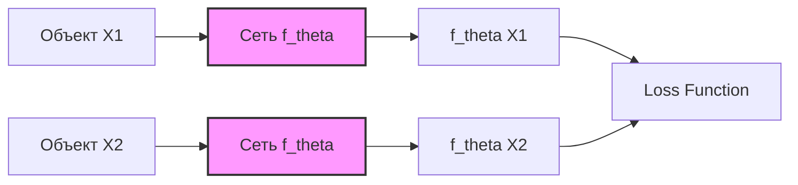
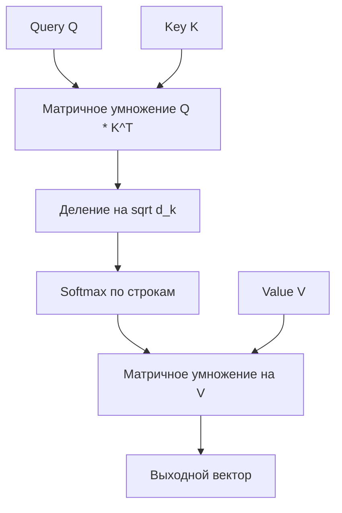

# Важнейшие темы к экзамену по Глубокому Обучению (Deep Learning)

В данном файле собраны ключевые теоретические концепции, математические выводы и примеры практических задач по наиболее важным темам экзаменационной программы. Этот материал структурирован так, чтобы помочь вам получить максимальную оценку.

---

## Блок 1: Сверточные нейронные сети (CNN)

### 1.1. Базовые принципы свертки
Операция свертки (Convolution) в глубоком обучении представляет собой скольжение ядра (матрицы весов) по входному тензору и вычисление скалярного произведения весов ядра на локальные зоны пикселей входного изображения.

#### Механизм операции
Если входное изображение $I$ имеет размерность $H \times W \times C_{in}$ (высота, ширина, каналы), а ядро свертки $K$ имеет размерность $K_h \times K_w \times C_{in}$, то для каждого выходного канала $d \in \{1, \dots, C_{out}\}$ значение в позиции $(i, j)$ выходной карты признаков $O$ рассчитывается по формуле:

$$O_{i, j, d} = b_d + \sum_{c=1}^{C_{in}} \sum_{m=1}^{K_h} \sum_{n=1}^{K_w} I_{i \cdot S + m - 1, \, j \cdot S + n - 1, \, c} \cdot K_{m, n, c, d}$$

где:
*   $S$ — шаг свертки (**Stride**).
*   $b_d$ — смещение (**Bias**) для $d$-го фильтра.

#### Вычисление размерности выходной карты
Размер выходного тензора $H_{out} \times W_{out}$ после свертки с учетом заполнения нулями (**Padding** $P$), шага свертки (**Stride** $S$) и разряжения (**Dilation** $D$) рассчитывается следующим образом:

$$H_{out} = \left\lfloor \frac{H_{in} - K_{eff\_h} + 2P}{S} \right\rfloor + 1$$
$$W_{out} = \left\lfloor \frac{W_{in} - K_{eff\_w} + 2P}{S} \right\rfloor + 1$$

где эффективный размер ядра с учетом dilation $D$ равен:
$$K_{eff} = K + (K - 1)(D - 1)$$

> [!NOTE]
> **Обучение свертки:** Ядро свертки — это обучаемые параметры. При обратном распространении ошибки (Backpropagation) градиент функции потерь по весам ядра свертки вычисляется как кросс-корреляция между входной картой признаков и градиентом от последующего слоя:
> $$\frac{\partial \mathcal{L}}{\partial K} = I * \frac{\partial \mathcal{L}}{\partial O}$$

---

### 1.2. Метрические методы и сиамские сети
Сиамские нейронные сети (Siamese Networks) используются для сравнения объектов (задачи верификации лиц, поиска дубликатов, подписи).

#### Концепция
Вместо классификации объектов на $N$ классов сиамская сеть учится отображать входные объекты высокой размерности в компактное пространство эмбеддингов (векторов низкой размерности) $\mathbb{R}^d$, где расстояние между эмбеддингами отражает семантическое сходство объектов.



*   **Параллельные подсети с общими весами:** Две (или три) одинаковые архитектурно подсети используют одни и те же веса $\theta$. Это гарантирует, что два одинаковых изображения гарантированно получат одинаковый эмбеддинг, а градиенты будут обновлять веса согласованно.

#### Функции потерь (Loss Functions)

1. **Контрастивная функция потерь (Contrastive Loss):**
   Применяется для пары объектов $(x_1, x_2)$. Пусть $y = 1$, если объекты из одного класса (положительная пара), и $y = 0$, если из разных классов (отрицательная пара).
   Пусть $D = \|f(x_1) - f(x_2)\|_2$ — евклидово расстояние между эмбеддингами.
   
   $$\mathcal{L}_{contrastive}(x_1, x_2, y) = y \frac{1}{2} D^2 + (1 - y) \frac{1}{2} \max\left(0, \, m - D\right)^2$$
   
   где $m > 0$ — гиперпараметр зазора (**Margin**).
   *   **Интуиция:** Если объекты похожи ($y=1$), мы минимизируем расстояние $D^2$. Если непохожи ($y=0$), мы штрафуем сеть только если они находятся ближе, чем на расстояние $m$.

2. **Триплетная функция потерь (Triplet Loss):**
   Применяется для тройки объектов: якорь (**Anchor** $a$), положительный пример (**Positive** $p$, тот же класс, что и $a$) и отрицательный пример (**Negative** $n$, другой класс).
   
   $$\mathcal{L}_{triplet}(a, p, n) = \max\left(0, \, \|f(a) - f(p)\|_2^2 - \|f(a) - f(n)\|_2^2 + \alpha\right)$$
   
   где $\alpha > 0$ — Margin.
   *   **Интуиция:** Loss равен нулю, только если расстояние до отрицательного примера превышает расстояние до положительного минимум на величину $\alpha$: $D(a, p)^2 + \alpha < D(a, n)^2$.

---

### 1.3. Физически информированные нейронные сети (PINN)
Физически информированные нейронные сети (Physics-Informed Neural Networks) — это класс архитектур, которые используют фундаментальные физические законы (выраженные в виде дифференциальных уравнений) для регуляризации обучения.

#### В чем отличие от стандартных сетей?
*   **Обучение только на данных:** «Черный ящик», который ищет корреляции в обучающей выборке. При выходе за пределы распределения (экстраполяция) ведет себя непредсказуемо и может выдавать физически невозможные результаты.
*   **PINN:** Нейросеть выступает аппроксиматором решения дифференциального уравнения $u(x, t) \approx \hat{u}(x, t; \theta)$. Физика встраивается напрямую в функцию потерь через штраф за несоблюдение уравнения.

#### Математическая формулировка и роль Autograd
Пусть задано дифференциальное уравнение общего вида для функции $u(x, t)$ на области $\Omega$:

$$\mathcal{F}\left(u, \, \frac{\partial u}{\partial x}, \, \frac{\partial u}{\partial t}, \, \frac{\partial^2 u}{\partial x^2}, \, \dots\right) = 0, \quad x, t \in \Omega$$

с начальными и граничными условиями $\mathcal{B}(u) = 0$.

Функция потерь PINN состоит из трех основных частей:

$$\mathcal{L}_{total} = w_{data} \mathcal{L}_{data} + w_{PDE} \mathcal{L}_{PDE} + w_{BC} \mathcal{L}_{BC}$$

1.  **Компонент данных (Data Loss):** Стандартная ошибка на известных экспериментальных или исторических точках:
    $$\mathcal{L}_{data} = \frac{1}{N_{data}} \sum_{i=1}^{N_{data}} \left| \hat{u}(x_d^i, t_d^i) - u_{true}^i \right|^2$$
2.  **Компонент уравнения (PDE Loss):** Вычисляется в случайно выбранных точках внутри области (называемых **точками коллокации** — collocation points):
    $$\mathcal{L}_{PDE} = \frac{1}{N_{coll}} \sum_{j=1}^{N_{coll}} \left| \mathcal{F}\left(\hat{u}, \, \frac{\partial \hat{u}}{\partial x}, \, \frac{\partial \hat{u}}{\partial t}, \, \dots\right) \right|^2$$
3.  **Компонент начальных/граничных условий (BC/IC Loss):**
    $$\mathcal{L}_{BC} = \frac{1}{N_{BC}} \sum_{k=1}^{N_{BC}} \left| \mathcal{B}(\hat{u}(x_b^k, t_b^k)) \right|^2$$

> [!IMPORTANT]
> **Роль Autograd в PINN:** Производные $\frac{\partial \hat{u}}{\partial x}$, $\frac{\partial^2 \hat{u}}{\partial x^2}$ и т.д. вычисляются с использованием **автоматического дифференцирования (Autograd)** сети по входным переменным $x$ и $t$ (а не по весам сети!). Это дает точные аналитические значения производных без использования конечно-разностных сеток, что делает PINN полностью сеточными (mesh-free) методами.

---

## Блок 2: Обработка последовательностей (Рекуррентные сети и Трансформеры)

### 2.1. Механизм внимания (Attention) и самовнимания (Self-Attention)
Механизм внимания позволяет сети динамически фокусироваться на различных частях последовательности независимо от расстояния между ними.

#### Понятия Query, Key, Value
Каждому входному вектору $x_i$ сопоставляются три вектора с помощью линейных проекций (матриц весов $W^Q, W^K, W^V$):
*   **Query ($q_i = W^Q x_i$):** «Запрос» текущего токена — то, что мы ищем в других токенах.
*   **Key ($k_i = W^K x_i$):** «Ключ» токена — описание его информационного содержания.
*   **Value ($v_i = W^V x_i$):** «Значение» токена — само содержательное наполнение, которое мы перенесем в выходной вектор.

#### Формула Scaled Dot-Product Attention
Для матриц $Q \in \mathbb{R}^{T \times d_k}$, $K \in \mathbb{R}^{T \times d_k}$, $V \in \mathbb{R}^{T \times d_v}$:

$$\text{Attention}(Q, K, V) = \text{softmax}\left( \frac{Q K^T}{\sqrt{d_k}} \right) V$$



#### Зачем делить на $\sqrt{d_k}$?
При больших значениях размерности ключей $d_k$ скалярное произведение $q \cdot k$ может принимать очень большие по модулю значения.
Если предположить, что компоненты $q$ и $k$ являются независимыми случайными величинами со средним $0$ и дисперсией $1$, то их скалярное произведение имеет среднее $0$ и дисперсию $d_k$:

$$\mathbb{D}[q \cdot k] = d_k$$

Без масштабирования дисперсия произведения будет равна $d_k$. При больших $d_k$ значения на входе в Softmax будут сильно различаться, из-за чего Softmax перейдет в насыщение (выдаст вероятности, близкие к 1 для максимума и к 0 для остальных). Это приведет к **затуханию градиентов** при обратном распространении ошибки. Деление на $\sqrt{d_k}$ возвращает дисперсию аргументов Softmax к 1.

---

### 2.2. Маскированное внимание (Masked Attention)
Применяется исключительно в блоках **Декодера (Decoder)** для авторегрессионного моделирования (когда модель генерирует токены последовательно, один за другим).

#### Проблема подглядывания в будущее (Look-ahead)
В процессе обучения трансформер обрабатывает всю последовательность параллельно. Если использовать стандартное самовнимание в декодере, то токен в позиции $i$ сможет вычислить веса внимания к токенам в позициях $j > i$ (будущие токены). В реальном режиме генерации этих токенов еще нет, что приводит к рассогласованию обучения и инференса.

#### Техническая реализация через аддитивную маску
Перед вычислением Softmax к матрице сходства $Q K^T$ прибавляется маска $M$:

$$\text{MaskedAttention}(Q, K, V) = \text{softmax}\left( \frac{Q K^T}{\sqrt{d_k}} + M \right) V$$

Матрица маски $M$ имеет размер $T \times T$ и заполняется следующим образом:

$$M_{i, j} = \begin{cases} 0, & \text{если } j \le i \\ -\infty, & \text{если } j > i \end{cases}$$

В виде матрицы это выглядит так:
$$M = \begin{pmatrix}
0 & -\infty & -\infty & \dots & -\infty \\
0 & 0 & -\infty & \dots & -\infty \\
0 & 0 & 0 & \dots & -\infty \\
\vdots & \vdots & \vdots & \ddots & \vdots \\
0 & 0 & 0 & \dots & 0
\end{pmatrix}$$

Когда к значению сходства прибавляется $-\infty$, то при вычислении Softmax экспонента этого значения обращается в ноль ($e^{-\infty} = 0$). Таким образом, веса внимания для всех будущих токенов становятся строго равными нулю, исключая любое влияние будущей информации.

---

## Блок 3: Обучение с подкреплением (Reinforcement Learning)

### 3.1. Функция полезности (Value Function)
Функции полезности оценивают, насколько «хорошо» агенту находиться в данном состоянии или совершать определенное действие.

*   **Ценность состояния (State-Value Function) $V^\pi(s)$:** Ожидаемая дисконтированная сумма будущих наград при старте из состояния $s$ и следовании стратегии $\pi$:
    $$V^\pi(s) = \mathbb{E}_\pi \left[ G_t \mid S_t = s \right] = \mathbb{E}_\pi \left[ \sum_{k=0}^{\infty} \gamma^k R_{t+k+1} \;\middle|\; S_t = s \right]$$
*   **Ценность действия (Action-Value Function) $Q^\pi(s, a)$:** Ожидаемая дисконтированная сумма будущих наград при старте из состояния $s$, выполнении действия $a$ и последующем следовании стратегии $\pi$:
    $$Q^\pi(s, a) = \mathbb{E}_\pi \left[ G_t \mid S_t = s, A_t = a \right] = \mathbb{E}_\pi \left[ \sum_{k=0}^{\infty} \gamma^k R_{t+k+1} \;\middle|\; S_t = s, A_t = a \right]$$
*   **Связь между ними:**
    $$V^\pi(s) = \sum_{a \in A} \pi(a \mid s) Q^\pi(s, a)$$

---

### 3.2. Математический вывод уравнений Беллмана
Уравнения Беллмана связывают ценность текущего состояния с ценностью последующих состояний через рекурсивную структуру.

#### Вывод для $V^\pi(s)$
Используем рекурсивное определение дисконтированного возврата $G_t = R_{t+1} + \gamma G_{t+1}$:

$$V^\pi(s) = \mathbb{E}_\pi \left[ R_{t+1} + \gamma G_{t+1} \mid S_t = s \right]$$

Распишем математическое ожидание через суммы по всем возможным действиям $a$, следующим состояниям $s'$ и наградам $r$:

$$V^\pi(s) = \sum_{a} \pi(a \mid s) \sum_{s'} \sum_{r} p(s', r \mid s, a) \left[ r + \gamma \mathbb{E}_\pi \left[ G_{t+1} \mid S_{t+1} = s' \right] \right]$$

Так как $\mathbb{E}_\pi \left[ G_{t+1} \mid S_{t+1} = s' \right] = V^\pi(s')$, получаем классическое **уравнение Беллмана для $V(s)$**:

$$V^\pi(s) = \sum_{a} \pi(a \mid s) \sum_{s', r} p(s', r \mid s, a) \left[ r + \gamma V^\pi(s') \right]$$

Аналогично выводится **уравнение Беллмана для $Q(s, a)$**:

$$Q^\pi(s, a) = \sum_{s', r} p(s', r \mid s, a) \left[ r + \gamma \sum_{a'} \pi(a' \mid s') Q^\pi(s', a') \right]$$

#### Уравнения оптимальности Беллмана (Bellman Optimality Equations)
Для оптимальной стратегии $\pi^*$ функции полезности обозначаются как $V^*(s)$ и $Q^*(s, a)$. Оптимальная стратегия выбирает действие, максимизирующее ожидаемую полезность:

$$V^*(s) = \max_{a} Q^*(s, a)$$

Подставляя это отношение в уравнения Беллмана, получаем нелинейные уравнения оптимальности:

$$V^*(s) = \max_{a} \sum_{s', r} p(s', r \mid s, a) \left[ r + \gamma V^*(s') \right]$$

$$Q^*(s, a) = \sum_{s', r} p(s', r \mid s, a) \left[ r + \gamma \max_{a'} Q^*(s', a') \right]$$

---

### 3.3. Алгоритм Q-learning
Q-learning — это **внетраекторный** (off-policy) метод временных различий (Temporal Difference, TD(0)) для нахождения оптимальной ценности действий без знания модели переходов среды.

#### Формула обновления весов (Q-таблицы)
На каждом шаге взаимодействия со средой $(S_t, A_t, R_{t+1}, S_{t+1})$ обновление Q-значения производится по формуле:

$$Q(S_t, A_t) \leftarrow Q(S_t, A_t) + \alpha \left( \text{TD\_Target} - Q(S_t, A_t) \right)$$

где:
*   $\alpha \in (0, 1]$ — скорость обучения (Learning Rate).
*   **Целевое значение TD (TD Target):** $Y_t^{Q} = R_{t+1} + \gamma \max_{a} Q(S_{t+1}, a)$.
*   **Ошибка TD (TD Error):** $\delta_t = R_{t+1} + \gamma \max_{a} Q(S_{t+1}, a) - Q(S_t, A_t)$.

> [!IMPORTANT]
> **Почему это off-policy алгоритм?**
> Алгоритм оценивает оптимальную стратегию (выбирая действие $a$, максимизирующее $Q(S_{t+1}, a)$), в то время как поведение агента (выбор действия $A_t$) определяется другой, более «исследовательской» стратегией (например, $\epsilon$-greedy). Агент обновляет ценность действия $A_t$ в предположении, что на следующем шаге он поведет себя абсолютно рационально (жадно), независимо от того, какое действие он реально совершит в действительности.

---

### 3.4. Методы Монте-Карло (MC) в RL
Методы Монте-Карло обучают функции полезности на основе усреднения фактического возврата (наград), полученных в конце полных эпизодов.

#### Основные свойства
*   **Безмодельность (Model-Free):** Не требуют знания вероятностей переходов среды $p(s', r \mid s, a)$.
*   **Обучение по целым эпизодам:** Обновление оценок происходит только после завершения эпизода (терминального состояния).
    $$V(S_t) \leftarrow V(S_t) + \alpha \left( G_t - V(S_t) \right)$$
    где $G_t = R_{t+1} + \gamma R_{t+2} + \dots + \gamma^{T-t-1} R_T$ — полный дисконтированный возврат.

| Характеристика | Методы Монте-Карло (MC) | Временные различия (TD) |
| :--- | :--- | :--- |
| **Когда обновление?** | Только в конце эпизода | На каждом шаге (bootstrapping) |
| **Смещение (Bias)** | Нулевое (несмещенная оценка $G_t$) | Высокое (цель зависит от текущих оценок) |
| **Дисперсия (Variance)** | Высокая (зависит от цепочки случайных шагов) | Низкая (обновление по одному шагу) |
| **Применимость** | Только для эпизодических задач | Для любых задач (включая бесконечные) |

---

### 3.5. Различие стратегий: Value-based vs Policy-based
1.  **Value-based (Методы на основе полезности):**
    *   **Цель:** Оценка ценности состояний/действий ($V$ или $Q$).
    *   **Стратегия:** Неявная, обычно жадная или $\epsilon$-greedy относительно вычисленной Q-функции.
    *   **Примеры:** Q-learning, SARSA, DQN.
    *   **Минус:** Плохо работают в непрерывных пространствах действий.
2.  **Policy-based (Методы на основе оптимизации стратегии):**
    *   **Цель:** Прямая оптимизация параметров $\theta$ самой стратегии $\pi_\theta(a \mid s)$ без обязательного расчета промежуточных ценностей.
    *   **Стратегия:** Задается явно дифференцируемой функцией (например, нейросетью, возвращающей вероятности действий).
    *   **Примеры:** REINFORCE, Policy Gradient.
    *   **Плюс:** Эффективно работают в непрерывных пространствах действий, могут выучивать стохастические стратегии.

---

## Тема на «особый большой плюс» (Отличная оценка)

### 4.1. Вариационные автоэнкодеры (VAE / CVAE)
VAE — это генеративная модель, которая строит непрерывное распределение в латентном пространстве для генерации новых данных.

#### Математический вывод нижней границы правдоподобия (ELBO)
Мы хотим максимизировать логарифм правдоподобия данных $\log p(x)$ по параметрам генератора. Введем вариационное распределение $q_\phi(z \mid x)$ (кодер), аппроксимирующее истинное апостериорное распределение $p(z \mid x)$.

$$\log p(x) = \log \int p(x, z) dz = \log \int q_\phi(z \mid x) \frac{p(x, z)}{q_\phi(z \mid x)} dz$$

Используем неравенство Йенсена для вогнутой функции логарифма ($\log \mathbb{E}[X] \ge \mathbb{E}[\log X]$):

$$\log p(x) \ge \mathbb{E}_{q_\phi(z \mid x)} \left[ \log \frac{p(x, z)}{q_\phi(z \mid x)} \right]$$

Распишем выражение под математическим ождинанием:

$$\text{ELBO}(\theta, \phi; x) = \mathbb{E}_{q_\phi(z \mid x)} \left[ \log \frac{p_\theta(x \mid z) p(z)}{q_\phi(z \mid x)} \right]$$

$$\text{ELBO}(\theta, \phi; x) = \mathbb{E}_{q_\phi(z \mid x)} \left[ \log p_\theta(x \mid z) \right] + \mathbb{E}_{q_\phi(z \mid x)} \left[ \log \frac{p(z)}{q_\phi(z \mid x)} \right]$$

Второе слагаемое — это взятая с обратным знаком дивергенция Кульбака-Лейблера (KL-дивергенция) между кодером и априорным распределением латентного кода $p(z)$:

$$\text{ELBO}(\theta, \phi; x) = \mathbb{E}_{q_\phi(z \mid x)} \left[ \log p_\theta(x \mid z) \right] - D_{KL}\left(q_\phi(z \mid x) \parallel p(z)\right)$$

Таким образом, функция потерь VAE (минимизируется) имеет вид:

$$\mathcal{L}_{VAE} = -\text{ELBO} = \underbrace{- \mathbb{E}_{q_\phi(z \mid x)} \left[ \log p_\theta(x \mid z) \right]}_{\text{Ошибка реконструкции}} + \underbrace{D_{KL}\left(q_\phi(z \mid x) \parallel p(z)\right)}_{\text{Регуляризация (KL)}}$$

```
                [ Вход X ]
                    |
                    v
              [   Кодер   ]
             /             \
            v               v
     Среднее \mu     Дисперсия \sigma^2
            \               /
             v             v
       [ Reparameterization Trick ] <--- Шум \epsilon ~ N(0, I)
                    |
                    v
         Латентный вектор Z
                    |
                    v
              [  Декодер  ]
                    |
                    v
             [ Выход \hat{X} ]
```

*   **Ошибка реконструкции:** Требует, чтобы декодер качественно восстанавливал исходные данные $x$ из латентного вектора $z$ (например, MSE или Cross-Entropy).
*   **Регуляризация KL:** Требует, чтобы распределение эмбеддингов $q_\phi(z \mid x)$ было близко к стандартному нормальному распределению $p(z) \sim \mathcal{N}(0, I)$. Это обеспечивает непрерывность, сглаженность и отсутствие пустот в латентном пространстве.

#### Репараметризационный трюк (Reparameterization Trick)
Кодер предсказывает параметры нормального распределения: вектор средних $\mu(x)$ и диагональную матрицу ковариации (вектор стандартных отклонений $\sigma(x)$). 
Если мы будем сэмплировать напрямую: $z \sim \mathcal{N}(\mu, \sigma^2)$, операция сэмплирования будет являться случайным узлом графа. Через нее невозможно пропустить градиент при бэкпропе (нет производной по параметрам $\mu$ и $\sigma$).

**Решение:**
Мы выносим случайность во внешнюю независимую переменную $\epsilon \sim \mathcal{N}(0, I)$ и выражаем $z$ линейным преобразованием:

$$z = \mu(x) + \sigma(x) \odot \epsilon$$

где $\odot$ — поэлементное умножение. Теперь операция сэмплирования стала детерминированной и дифференцируемой относительно параметров сети $\mu$ и $\sigma$, а градиенты без проблем текут обратно в кодер.

---

### 4.2. Связь MLE (Метода максимального правдоподобия) с функциями потерь
Любая стандартная функция потерь в DL строго выводится из статистического принципа максимального правдоподобия.

#### 1. Вывод MSE (L2-нормы) для регрессии
Пусть истинная зависимость описывается как $y_i = f(x_i; w) + \epsilon_i$, где шум измерений $\epsilon_i$ распределен по нормальному закону с нулевым математическим ожиданием и дисперсией $\sigma^2$: $\epsilon_i \sim \mathcal{N}(0, \sigma^2)$.
Тогда условная плотность распределения $y_i$ при заданном $x_i$ имеет вид:

$$p(y_i \mid x_i; w) = \frac{1}{\sqrt{2\pi\sigma^2}} \exp\left( -\frac{(y_i - f(x_i; w))^2}{2\sigma^2} \right)$$

Функция правдоподобия выборки (для независимых наблюдений):
$$L(w) = \prod_{i=1}^N p(y_i \mid x_i; w)$$

Логарифм правдоподобия (Log-Likelihood):
$$\log L(w) = \sum_{i=1}^N \log p(y_i \mid x_i; w) = -\frac{N}{2}\log(2\pi\sigma^2) - \frac{1}{2\sigma^2} \sum_{i=1}^N (y_i - f(x_i; w))^2$$

Поскольку мы максимизируем $\log L(w)$ по параметрам $w$, константы можно отбросить. Максимизация выражения эквивалентна минимизации отрицательного логарифма правдоподобия:

$$\arg\max_w \log L(w) = \arg\min_w \sum_{i=1}^N (y_i - f(x_i; w))^2 \propto \text{MSE}$$

Таким образом, минимизация MSE эквивалентна максимизации правдоподобия при предположении аддитивного нормального шума в данных.

#### 2. Вывод Кросс-энтропии для классификации
Для задачи бинарной классификации предположим, что метка класса $y_i \in \{0, 1\}$ имеет распределение Бернулли с параметром $p_i = \sigma(f(x_i; w))$ (предсказанная моделью вероятность класса 1).
Тогда функция распределения:
$$P(y_i \mid x_i; w) = p_i^{y_i} (1 - p_i)^{1 - y_i}$$

Логарифм правдоподобия:
$$\log L(w) = \sum_{i=1}^N \left( y_i \log p_i + (1 - y_i) \log (1 - p_i) \right)$$

Минимизация отрицательного логарифма правдоподобия приводит к **Binary Cross-Entropy (BCE)** loss:

$$\mathcal{L}_{BCE} = -\sum_{i=1}^N \left[ y_i \log p_i + (1 - y_i) \log (1 - p_i) \right]$$

Аналогично для многоклассовой классификации (с распределением Мультинулли) максимизация правдоподобия приводит к категориальной кросс-энтропии.

---

## Раздел 5: Характер практических задач в билете (Пошаговый разбор)

### Задача 1: Ручной расчет выходной карты признаков CNN
**Условие:**
Дана входная матрица изображения $I$ размера $4 \times 4$ (один канал):
$$I = \begin{pmatrix}
1 & 2 & 3 & 0 \\
0 & 1 & 2 & 1 \\
2 & 0 & 1 & 0 \\
1 & 2 & 0 & 1
\end{pmatrix}$$

И ядро свертки $K$ размера $3 \times 3$:
$$K = \begin{pmatrix}
1 & 0 & -1 \\
2 & 0 & -2 \\
1 & 0 & -1
\end{pmatrix}$$

Параметры: Padding $P=0$, Stride $S=1$, Bias $b=0$. 
Необходимо рассчитать выходную карту признаков $O$.

#### Решение:
1.  **Определим размер выходной матрицы:**
    $$H_{out} = \frac{4 - 3 + 2\cdot 0}{1} + 1 = 2$$
    Размер выходной карты составит $2 \times 2$. Обозначим ее элементы как:
    $$O = \begin{pmatrix} O_{1,1} & O_{1,2} \\ O_{2,1} & O_{2,2} \end{pmatrix}$$

2.  **Пошаговый расчет элементов:**

    *   **Элемент $O_{1,1}$ (левое верхнее окно изображения):**
        Вырезаем фрагмент $I[1:3, 1:3]$:
        $$I_{sub1} = \begin{pmatrix} 1 & 2 & 3 \\ 0 & 1 & 2 \\ 2 & 0 & 1 \end{pmatrix}$$
        Вычисляем попиксельное произведение и сумму:
        $$O_{1,1} = (1 \cdot 1) + (2 \cdot 0) + (3 \cdot -1) + (0 \cdot 2) + (1 \cdot 0) + (2 \cdot -2) + (2 \cdot 1) + (0 \cdot 0) + (1 \cdot -1)$$
        $$O_{1,1} = 1 + 0 - 3 + 0 + 0 - 4 + 2 + 0 - 1 = \mathbf{-5}$$

    *   **Элемент $O_{1,2}$ (смещение вправо на Stride=1):**
        Вырезаем фрагмент $I[1:3, 2:4]$:
        $$I_{sub2} = \begin{pmatrix} 2 & 3 & 0 \\ 1 & 2 & 1 \\ 0 & 1 & 0 \end{pmatrix}$$
        Вычисляем:
        $$O_{1,2} = (2 \cdot 1) + (3 \cdot 0) + (0 \cdot -1) + (1 \cdot 2) + (2 \cdot 0) + (1 \cdot -2) + (0 \cdot 1) + (1 \cdot 0) + (0 \cdot -1)$$
        $$O_{1,2} = 2 + 0 + 0 + 2 + 0 - 2 + 0 + 0 + 0 = \mathbf{2}$$

    *   **Элемент $O_{2,1}$ (смещение вниз на Stride=1):**
        Вырезаем фрагмент $I[2:4, 1:3]$:
        $$I_{sub3} = \begin{pmatrix} 0 & 1 & 2 \\ 2 & 0 & 1 \\ 1 & 2 & 0 \end{pmatrix}$$
        Вычисляем:
        $$O_{2,1} = (0 \cdot 1) + (1 \cdot 0) + (2 \cdot -1) + (2 \cdot 2) + (0 \cdot 0) + (1 \cdot -2) + (1 \cdot 1) + (2 \cdot 0) + (0 \cdot -1)$$
        $$O_{2,1} = 0 + 0 - 2 + 4 + 0 - 2 + 1 + 0 + 0 = \mathbf{1}$$

    *   **Элемент $O_{2,2}$ (смещение вправо и вниз на Stride=1):**
        Вырезаем фрагмент $I[2:4, 2:4]$:
        $$I_{sub4} = \begin{pmatrix} 1 & 2 & 1 \\ 0 & 1 & 0 \\ 2 & 0 & 1 \end{pmatrix}$$
        Вычисляем:
        $$O_{2,2} = (1 \cdot 1) + (2 \cdot 0) + (1 \cdot -1) + (0 \cdot 2) + (1 \cdot 0) + (0 \cdot -2) + (2 \cdot 1) + (0 \cdot 0) + (1 \cdot -1)$$
        $$O_{2,2} = 1 + 0 - 1 + 0 + 0 + 0 + 2 + 0 - 1 = \mathbf{1}$$

**Ответ:**
$$O = \begin{pmatrix} -5 & 2 \\ 1 & 1 \end{pmatrix}$$

---

### Задача 2: Шаг обновления Q-значения (Temporal Difference)
**Условие:**
Дан марковский процесс принятия решений. В состоянии $S_t = s_1$ агент выбирает действие $A_t = a_{go}$.
*   Текущая таблица Q-значений:
    *   $Q(s_1, a_{go}) = 2.0$
    *   $Q(s_1, a_{stay}) = 1.0$
    *   $Q(s_2, a_{go}) = 3.0$
    *   $Q(s_2, a_{stay}) = 4.0$
*   Параметры среды:
    *   Награда за переход $R_{t+1} = 5.0$.
    *   Следующее состояние $S_{t+1} = s_2$.
    *   Фактор дисконтирования $\gamma = 0.9$.
    *   Скорость обучения $\alpha = 0.1$.

Необходимо обновить значение $Q(s_1, a_{go})$ по алгоритму Q-learning.

#### Решение:
1.  **Запишем общую формулу Q-learning обновления:**
    $$Q(S_t, A_t) \leftarrow Q(S_t, A_t) + \alpha \left[ R_{t+1} + \gamma \max_{a} Q(S_{t+1}, a) - Q(S_t, A_t) \right]$$

2.  **Шаг 1: Найдем максимальное Q-значение для следующего состояния $S_{t+1} = s_2$:**
    $$\max_{a} Q(s_2, a) = \max(Q(s_2, a_{go}), \, Q(s_2, a_{stay})) = \max(3.0, \, 4.0) = 4.0$$

3.  **Шаг 2: Рассчитаем TD Target:**
    $$\text{TD Target} = R_{t+1} + \gamma \max_{a} Q(S_{t+1}, a) = 5.0 + 0.9 \cdot 4.0 = 5.0 + 3.6 = 8.6$$

4.  **Шаг 3: Рассчитаем TD Error ($\delta$):**
    $$\delta = \text{TD Target} - Q(s_1, a_{go}) = 8.6 - 2.0 = 6.6$$

5.  **Шаг 4: Рассчитаем новое значение $Q(s_1, a_{go})$:**
    $$Q(s_1, a_{go}) \leftarrow 2.0 + 0.1 \cdot 6.6 = 2.0 + 0.66 = \mathbf{2.66}$$

**Ответ:** 
Новое значение $Q(s_1, a_{go}) = 2.66$.

---

### Задача 3: Расчет количества обучаемых параметров нейросети
**Условие:**
Дана архитектура сверточной нейросети, принимающая на вход RGB-изображение размера $32 \times 32 \times 3$. Сеть состоит из следующих слоев:
1.  **Conv2D:** ядро $3 \times 3$, 16 выходных фильтров (каналов), шаг 1, заполнение 1 (смещение/bias включено).
2.  **BatchNorm2D:** слой батч-нормализации.
3.  **MaxPooling2D:** окно $2 \times 2$, шаг 2.
4.  **Flatten:** выравнивание в одномерный вектор.
5.  **Linear (Dense):** полносвязный слой с выходом на 10 классов (смещение/bias включено).

Необходимо рассчитать количество обучаемых параметров для каждого слоя и суммарно по всей сети.

#### Решение:

1.  **Слой 1: Conv2D**
    *   Формула параметров свертки: $Params = (K_h \cdot K_w \cdot C_{in} + 1) \cdot C_{out}$ (единица отвечает за bias).
    *   $K_h = 3, K_w = 3, C_{in} = 3$ (RGB), $C_{out} = 16$.
    *   $Params = (3 \cdot 3 \cdot 3 + 1) \cdot 16 = (27 + 1) \cdot 16 = 28 \cdot 16 = \mathbf{448}$ параметров.

2.  **Слой 2: BatchNorm2D**
    *   Для каждого из $C$ каналов BatchNorm содержит 4 параметра: два обучаемых ($\gamma$ — масштаб, $\beta$ — сдвиг) и два неоцениваемых градиентным спуском, но обновляемых статистических параметра (скользящее среднее $\mu$ и скользящая дисперсия $\sigma^2$).
    *   Количество каналов на входе в BatchNorm равно числу выходных фильтров предыдущего слоя: $C = 16$.
    *   Обучаемых параметров: $2 \cdot C = 2 \cdot 16 = \mathbf{32}$ (всего параметров 64).

3.  **Слой 3: MaxPooling2D**
    *   Слой пулинга не имеет обучаемых параметров (это детерминированная операция поиска максимума).
    *   $Params = \mathbf{0}$.

4.  **Слой 4: Flatten**
    *   Операция изменения формы тензора. Обучаемых параметров нет.
    *   $Params = \mathbf{0}$.
    *   *Важно для следующего слоя: определим размерность выхода после Flatten.*
        *   Размер после Conv2D: т.к. $P=1, S=1$, размер пространственной карты не меняется: $32 \times 32 \times 16$.
        *   Размер после MaxPooling2D (размер уменьшается в 2 раза): $16 \times 16 \times 16$.
        *   Размер после Flatten: $16 \cdot 16 \cdot 16 = 4096$ элементов.

5.  **Слой 5: Linear (полносвязный)**
    *   Формула параметров: $Params = (N_{in} + 1) \cdot N_{out}$ (единица отвечает за bias).
    *   $N_{in} = 4096$, $N_{out} = 10$.
    *   $Params = (4096 + 1) \cdot 10 = 4097 \cdot 10 = \mathbf{40970}$ параметров.

**Итоговое количество обучаемых параметров:**
$$Total = 448 \text{ (Conv2D)} + 32 \text{ (BatchNorm)} + 40970 \text{ (Linear)} = \mathbf{41450}$$

---

### Задача 4: Ручной расчет механизма самовнимания (Self-Attention)
**Условие:**
Дана последовательность из двух токенов. Их матрицы проекций Query, Key, Value уже вычислены для размерности $d_k = 2$:
*   Матрица Query $Q$:
    $$Q = \begin{pmatrix} q_1 \\ q_2 \end{pmatrix} = \begin{pmatrix} 1 & 0 \\ 0 & 2 \end{pmatrix}$$
*   Матрица Key $K$:
    $$K = \begin{pmatrix} k_1 \\ k_2 \end{pmatrix} = \begin{pmatrix} 0 & 1 \\ 1 & 1 \end{pmatrix}$$
*   Матрица Value $V$:
    $$V = \begin{pmatrix} v_1 \\ v_2 \end{pmatrix} = \begin{pmatrix} 1 & 2 \\ 3 & 4 \end{pmatrix}$$

Рассчитать выходное значение самовнимания $A = \text{Attention}(Q, K, V)$ для первого токена (первую строку матрицы $A$).

#### Решение:

1.  **Формула:**
    $$\text{Attention}(Q, K, V) = \text{softmax}\left( \frac{Q K^T}{\sqrt{d_k}} \right) V$$
    Здесь $d_k = 2$, следовательно, масштабирующий коэффициент $\sqrt{d_k} = \sqrt{2} \approx 1.414$.

2.  **Шаг 1: Вычислим произведение $Q K^T$**
    $$QK^T = \begin{pmatrix} 1 & 0 \\ 0 & 2 \end{pmatrix} \begin{pmatrix} 0 & 1 \\ 1 & 1 \end{pmatrix} = \begin{pmatrix} 1\cdot 0 + 0\cdot 1 & 1\cdot 1 + 0\cdot 1 \\ 0\cdot 0 + 2\cdot 1 & 0\cdot 1 + 2\cdot 1 \end{pmatrix} = \begin{pmatrix} 0 & 1 \\ 2 & 2 \end{pmatrix}$$

3.  **Шаг 2: Разделим на $\sqrt{d_k} = \sqrt{2}$**
    $$\frac{QK^T}{\sqrt{2}} \approx \begin{pmatrix} 0 & 0.707 \\ 1.414 & 1.414 \end{pmatrix}$$

4.  **Шаг 3: Применим Softmax построчно**
    Для первой строки (первый токен) входные значения: $x = [0, \; 0.707]$.
    *   Экспоненты: $e^0 = 1.0$, $e^{0.707} \approx 2.028$.
    *   Сумма экспонент: $Sum = 1.0 + 2.028 = 3.028$.
    *   Веса внимания для первой строки:
        $$w_{1,1} = \frac{1.0}{3.028} \approx 0.33, \quad w_{1,2} = \frac{2.028}{3.028} \approx 0.67$$
    *   (Для справки: вторая строка $x = [1.414, \; 1.414]$ даст веса $[0.5, \; 0.5]$).
    *   Матрица весов внимания:
        $$W_{att} = \begin{pmatrix} 0.33 & 0.67 \\ 0.5 & 0.5 \end{pmatrix}$$

5.  **Шаг 4: Умножим веса внимания на матрицу Value $V$**
    Рассчитаем только первую строку выходной матрицы $A$ (для первого токена):
    $$A_1 = w_{1,1} \cdot v_1 + w_{1,2} \cdot v_2 = 0.33 \cdot \begin{pmatrix} 1 & 2 \end{pmatrix} + 0.67 \cdot \begin{pmatrix} 3 & 4 \end{pmatrix}$$
    $$A_{1, 1} = 0.33 \cdot 1 + 0.67 \cdot 3 = 0.33 + 2.01 = \mathbf{2.34}$$
    $$A_{1, 2} = 0.33 \cdot 2 + 0.67 \cdot 4 = 0.66 + 2.68 = \mathbf{3.34}$$

**Ответ:**
Выходное значение самовнимания для первого токена равно $\begin{pmatrix} 2.34 & 3.34 \end{pmatrix}$.

---

### Задача 5: Обновление Монте-Карло vs TD(0) на траектории
**Условие:**
Агент взаимодействует со средой по траектории (эпизоду):
$$S_0 \xrightarrow{R_1 = 2} S_1 \xrightarrow{R_2 = -1} S_2 \xrightarrow{R_3 = 10} S_{term}$$

Параметры:
*   Начальные оценки ценности состояний: $V(S_0) = 1.0, \; V(S_1) = 2.0, \; V(S_2) = 5.0$.
*   Фактор дисконтирования $\gamma = 0.9$.
*   Скорость обучения $\alpha = 0.2$.

Необходимо рассчитать обновленное значение $V(S_0)$ двумя методами:
1.  Методом Монте-Карло (MC).
2.  Методом временных различий (TD(0)).

#### Решение:

1.  **Метод Монте-Карло (MC)**
    *   Метод MC обновляет ценности только после окончания эпизода на основе полного дисконтированного возврата $G_0$.
    *   Рассчитаем возврат $G_0$ с момента времени $t=0$:
        $$G_0 = R_1 + \gamma R_2 + \gamma^2 R_3 = 2 + 0.9 \cdot (-1) + 0.9^2 \cdot 10$$
        $$G_0 = 2 - 0.9 + 0.81 \cdot 10 = 1.1 + 8.1 = \mathbf{9.2}$$
    *   Обновление по формуле MC:
        $$V_{new}(S_0) = V(S_0) + \alpha (G_0 - V(S_0))$$
        $$V_{new}(S_0) = 1.0 + 0.2 \cdot (9.2 - 1.0) = 1.0 + 0.2 \cdot 8.2 = 1.0 + 1.64 = \mathbf{2.64}$$

2.  **Метод временных различий (TD(0))**
    *   Метод TD(0) обновляет ценность состояния $S_0$ сразу после перехода в $S_1$ и получения награды $R_1$, используя текущую оценку следующего состояния $V(S_1)$ (бутстрэпинг).
    *   Рассчитаем TD Target для состояния $S_0$:
        $$\text{TD Target} = R_1 + \gamma V(S_1) = 2 + 0.9 \cdot 2.0 = 2 + 1.8 = \mathbf{3.8}$$
    *   Обновление по формуле TD(0):
        $$V_{new}(S_0) = V(S_0) + \alpha (\text{TD Target} - V(S_0))$$
        $$V_{new}(S_0) = 1.0 + 0.2 \cdot (3.8 - 1.0) = 1.0 + 0.2 \cdot 2.8 = 1.0 + 0.56 = \mathbf{1.56}$$

**Ответ:**
*   После обновления методом Монте-Карло: $V(S_0) = 2.64$.
*   После обновления методом TD(0): $V(S_0) = 1.56$.

