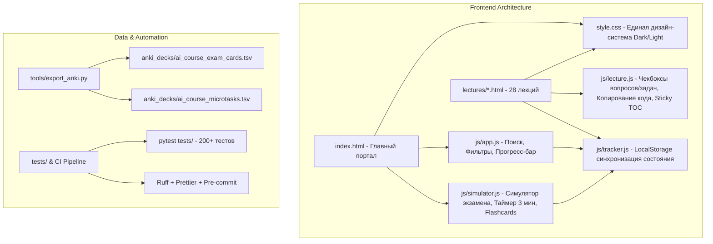

# Спецификация архитектуры и дизайна: Комплексная модернизация платформы «Методы ИИ» (ГУУ 2026)

## 1. Введение и цели проекта

Проект представляет собой учебно-методический комплекс и интерактивный веб-портал подготовки к устному экзамену по курсу «Методы искусственного интеллекта» (ГУУ 2026), состоящий из 28 лекций, 280+ вопросов преподавателя («🎯 Препод спросит») и 170+ практических микро-задач («📝 Микро-задачи»).

### Цели модернизации:
1. **Образовательный опыт и интерактивность:** Превратить статический портал в полноценную EdTech-платформу с симулятором устного экзамена (3-минутный таймер, рандомайзер билетов 1–25, режим Flashcards, банк задач с фильтрами).
2. **Трекинг прогресса и UX:** Внедрить бессерверный трекинг прогресса (LocalStorage), мгновенный полнотекстовый поиск с тегами, плавающее оглавление, копирование сниппетов кода, переключатель светлой/тёмной темы.
3. **Инженерное качество и DRY-архитектура:** Устранить дублирование 200+ строк `<style>` в каждом из 28 HTML-файлов лекций, вынести логику в модульные Vanilla JS скрипты, создать Python-инструмент экспорта колод Anki (`.tsv` / `.csv` / `.apkg`), настроить `pre-commit` и расширить автоматический E2E тестовый комплекс.

---

## 2. Архитектура системы и модулей

---

## 3. Компоненты платформы

### 3.1. Интерактивный симулятор экзамена (`js/simulator.js`)
Встраивается в `index.html` в виде специального интерактивного блока над списком лекций:
- **Режим 1: «Вытянуть случайный билет (1–25)»**
  - Генерирует случайный билет согласно официальной сетке соответствия ГУУ.
  - Показывает: Название билета, связанные лекции, ключевой тезисный конспект из «⚡ Ответ за 3 минуты».
  - Включает интерактивный таймер обратного отсчета на **3:00 минуты** (со звуковым/визуальным сигналом и кнопками Старт / Пауза / Сброс).
  - Подгружает 2 случайных каверзных вопроса преподавателя и 1 расчетную задачу для самопроверки у доски.
- **Режим 2: «Flashcards / Блиц-опрос (280+ вопросов)»**
  - Интерактивная карточка: Вопрос преподавателя → кнопка «Показать ответ» → кнопки самооценки («Знаю на 100%» / «Сомневаюсь» / «Не помню»).
  - Фильтрация по дням/модулям (День 1, День 2, День 3) или конкретным темам.
  - Статистика сессии: сколько вопросов повторено, процент уверенных ответов.
- **Режим 3: «Банк задач (170+ задач)»**
  - Быстрый просмотр и фильтрация всех микро-задач курса по темам (Матричные градиенты, Свертки, Attention, VAE, RL, BLEU и др.).
  - Поле ввода для самостоятельного расчета и скрытый аккордеон с пошаговым решением.
- **Режим 4: «Экспорт в Anki»**
  - Кнопка скачивания готовых колод для мобильного приложения Anki.

### 3.2. Система трекинга прогресса (`js/tracker.js`)
- Сохраняет прогресс в `localStorage` браузера без необходимости авторизации или бэкенда.
- Ключи состояния:
  - `ai_course_completed_lectures`: список ID прочитанных лекций (`['00', '01', ...]`).
  - `ai_course_checked_qas`: ID отмеченных изученными вопросов.
  - `ai_course_checked_tasks`: ID решенных задач.
  - `ai_course_theme`: выбранная тема (`'dark'` или `'light'`).
- На главной странице: отображается живой прогресс-бар:
  - Прогресс по лекциям: `12 / 28 (43%)`
  - Прогресс по вопросам: `145 / 280 (52%)`
  - Прогресс по задачам: `80 / 170 (47%)`
  - Возможность сбросить или экспортировать/импортировать прогресс в JSON.

### 3.3. Внутристраничный интерактив лекций (`js/lecture.js`)
- **Копирование кода:** Во всех блоках `<pre><code>` добавляется аккуратная кнопка `📋 Копировать` в верхнем правом углу с анимацией `✓ Скопировано!`.
- **Чекбоксы в Q&A и задачах:** У каждого раскрывающегося блока `
` и `
` появляется микро-чекбокс «Выучено» / «Решено», сохраняющийся в LocalStorage.
- **Индикатор чтения:** Сверху страницы плавная линия прогресса скролла (Reading Progress Bar).
- **Плавающая кнопка «Наверх»:** Появляется при скролле вниз для быстрого возврата к содержанию.
- **Улучшенное оглавление:** Интерактивное сворачиваемое мобильное/десктопное меню быстрых переходов по разделам лекции.

### 3.4. Дизайн-система и темы (`style.css`)
- Поддержка двух режимов:
  - **Тёмная тема (по умолчанию):** текущий глубокий тёмный UI (`#0f1115`, `#161a21`, `#1b202a`).
  - **Светлая тема (для чтения днём и печати):** чистая академическая светлая тема (`#f8fafc`, `#ffffff`, `#e2e8f0`, контрастный текст `#0f172a`).
- Переключатель темы (иконка 🌙 / ☀️) в шапке портала и каждой лекции с сохранением выбора.
- `@media print` стили для идеальной распечатки конспектов без лишних фонов и навигационных кнопок.

---

## 4. Внутренняя и организационная организация (DX & CI/CD)

### 4.1. DRY-рефакторинг структуры файлов
- Замена дублирующихся тегов `<style>` во всех 28 файлах `lectures/*.html` на внешнюю ссылку:
  `<link rel="stylesheet" href="../style.css">`
- Подключение общих скриптов:
  ``
  ``
- Все 200 существующих тестов (`tests/`) сохраняют полную обратную совместимость.

### 4.2. Экспортер в Anki (`tools/export_anki.py`)
- Python-скрипт автоматически парсит все 28 файлов лекций, извлекая:
  - Все 280+ блоков `
` (вопрос и ответ) с сохранением LaTeX MathJax разметки.
  - Все 170+ блоков `
` (формулировка задачи и пошаговое решение).
  - Все 28 тезисных конспектов «⚡ Ответ за 3 минуты».
- Генерирует готовые файлы в директории `anki/`:
  - `ai_course_exam_questions.tsv` (UTF-8 TSV, готовый к импорту в Anki Desktop/Mobile).
  - `ai_course_microtasks.tsv`.
  - `ai_course_3min_cheatsheets.tsv`.

### 4.3. Автоматизация и Git Hooks (`.pre-commit-config.yaml`)
- Добавление конфигурации `pre-commit`:
  - `ruff check --fix` и `ruff format`.
  - `trailing-whitespace` и `end-of-file-fixer`.
  - `check-yaml`, `check-json`.

### 4.4. Тестирование и CI Pipeline
- Добавление новых тестов в `tests/`:
  - `test_exam_simulator_assets.py`: проверка целостности файлов JS, CSS и логики данных симулятора.
  - `test_anki_exporter.py`: автоматическая валидация генерации Anki колод и соответствия количества карточек.
  - `test_dry_css_refactor.py`: подтверждение отсутствия дублирующихся стилей и наличия внешних линков.
- Обновление `.github/workflows/ci.yml` для автоматического прогона всех новых проверок.

---

## 5. План верификации

### Автоматические тесты:
- `uv run pytest tests/` — все 200+ тестов (включая новые) проходят с 0 ошибок.
- `uv run ruff check .` — 0 ошибок линтера.
- `uv run python tools/export_anki.py` — успешная генерация валидных Anki TSV/CSV файлов.

### Ручная и браузерная верификация:
- Проверка работы рандомайзера билетов и таймера 3 минуты на главной странице.
- Проверка переключения режимов Flashcards и Задачника.
- Проверка сохранения чекбоксов прогресса в `localStorage` и обновления глобального прогресс-бара.
- Проверка переключения тёмной/светлой темы на десктопе и мобильных устройствах.
- Проверка корректного рендеринга MathJax во всех 28 лекциях.
